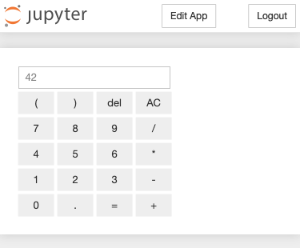

Appmode
=======

Jupyter-Erweiterung, die aus Notebooks Webanwendungen macht.

.. toctree::
    :titlesonly:
    :hidden:
    :maxdepth: 3

    app-example.ipynb

Beispiel
--------

Beim Klick auf :menuselection:`Appmode` wird aus dem Notebook
`app-example.ipynb <app-example.ipynb>`_ ein übersichtliche Web-Anwendung für
einen Rechner:

Installation
------------

Für den Jupyter-Service muss ``appmode`` installiert werden mit

.. code-block:: console

    $ uv add appmode
    $ uv run jupyter nbextension enable --py --sys-prefix appmode
    Enabling notebook extension appmode/main...
          - Validating: OK
    $ uv run jupyter serverextension enable --py --sys-prefix appmode
    Enabling: appmode.server_extension
    - Writing config: /Users/veit/.local/share/virtualenvs/jupyter-tutorial--q5BvmfG/bin/../etc/jupyter
        - Validating...
          appmode.server_extension  OK

Konfiguration
-------------

Serverseitige Konfiguration
~~~~~~~~~~~~~~~~~~~~~~~~~~~

Der Server kann mit folgenden drei Optionen konfiguriert werden:

``Appmode.trusted_path``
    führt den App-Modus nur für Notizbücher unter diesem Pfad aus;
    Voreinstellung: *Keine Einschränkungen*.

``Appmode.show_edit_button``
    zeigt :menuselection:`Edit App`-Taste im App-Modus an; Voreinstellung:
    ``True``

``Appmode.show_other_buttons``
    zeigt andere Schaltflächen im App-Modus an, :abbr:`z.B. (zum Beispiel)`
    :menuselection:`Logout`; Voreinstellung: ``True``

Weitere Infos zur Server-Konfiguration erhaltet ihr in :doc:`/notebook/config`.

Client-seitige Konfiguration
~~~~~~~~~~~~~~~~~~~~~~~~~~~~

Die UI-Elemente können auch client-seitig in der `custom.js
<https://jupyter-notebook.readthedocs.io/en/4.x/examples/Notebook/rstversions/JavaScript%20Notebook%20Extensions.html#custom-js>`_-Datei
angepasst werden, :abbr:`z.B. (zum Beispiel)` mit:

.. code-block:: Javascript

    // Hides the edit app button.
    $('#appmode-leave').hide();

    // Hides the kernel busy indicator.
    $('#appmode-busy').hide();

    // Adds a loading message.
    $('#appmode-loader').append('<h2>Loading...</h2>');

.. note::
    Das Ausblenden der :menuselection:`Edit App`-Taste hindert Benutzer nicht am
    Verlassen des App-Modus, indem die URL manuell geändert wird.
