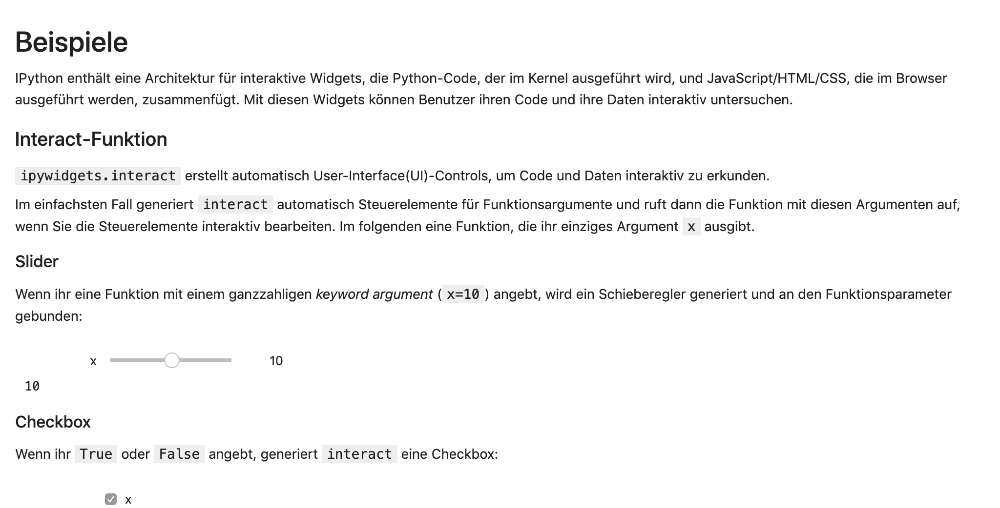
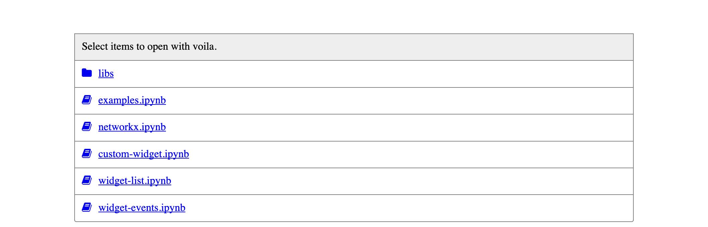
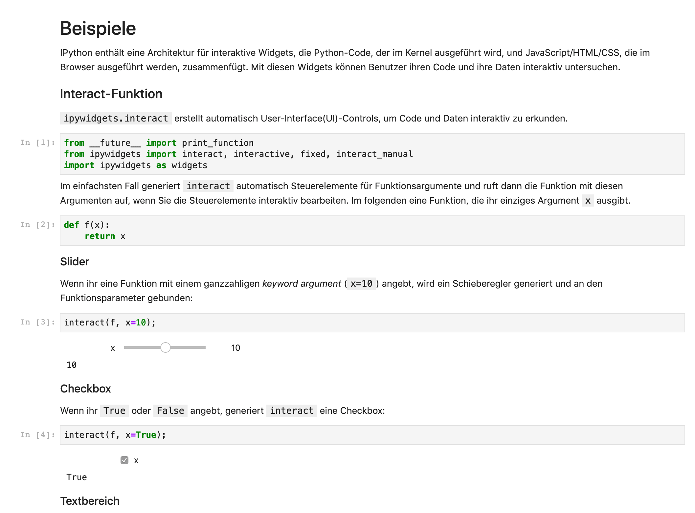

Installation und Nutzung
========================

Installation
------------

voilà kann installiert werden mit:

.. code-block:: console

   $ uv add voila

Starten
-------

… als eigenständige Anwendung
~~~~~~~~~~~~~~~~~~~~~~~~~~~~~

Ihr könnt die Installation überprüfen, indem ihr mit voilà
:abbr:`z.B. (zum Beispiel)` :file:`bqplot_vuetify_example.ipynb` aufruft. Für dieses Notebook müsst ihr jedoch zunächst noch ``bqplot`` und ``ipyvuetify``
installieren.

.. code-block:: console

   $ uv run voila 'docs/dashboards/voila/bqplot_vuetify_example.ipynb'
   ...
   [Voila] Voilà is running at:
   http://localhost:8866/

Hierbei sollte sich euer Standardbrowser öffnen und die ``voila``-Beispiele
aus unserem Tutorial anzeigen:

Alternativ könnt ihr euch auch ein Verzeichnis anzeigen lassen mit allen darin
enthaltenen Notebooks:

.. code-block:: console

   $ uv run voila 'docs/dashboards/voila/'

Es ist auch möglich, sich den Quellcode anzeigen zu lassen mit:

.. code-block:: console

   $ uv run voila --strip_sources=False 'docs/dashboards/voila/bqplot_vuetify_example.ipynb'

.. note::
   Beachtet, dass der Code nur angezeigt wird. Voilà erlaubt Benutzern nicht,
   den Code zu bearbeiten oder auszuführen.

Üblicherweise wird das ``light``-Theme verwendet; ihr könnt jedoch auch das
``dark``-Theme auswählen:

.. code-block:: console

   $ uv run voila --theme=dark 'docs/dashboards/voila/bqplot_vuetify_example.ipynb'

… als Erweiterung des Jupyter-Server
~~~~~~~~~~~~~~~~~~~~~~~~~~~~~~~~~~~~

Alternativ könnt ihr voilà auch als Erweiterung des Jupyter-Server starten:

.. code-block:: console

   $ uv run jupyter notebook

Anschließend könnt ihr voilà aufrufen, :abbr:`z.B. (zum Beispiel)` unter der URL
``http://localhost:8888/voila``.
