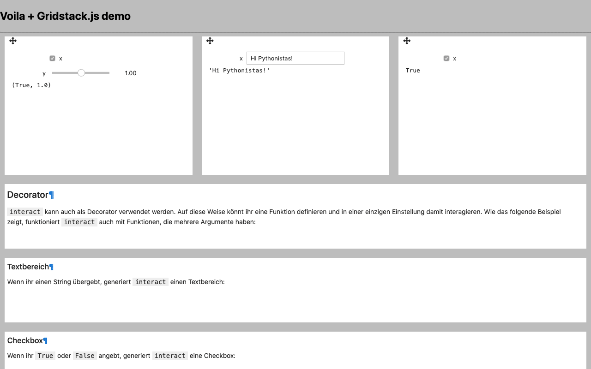
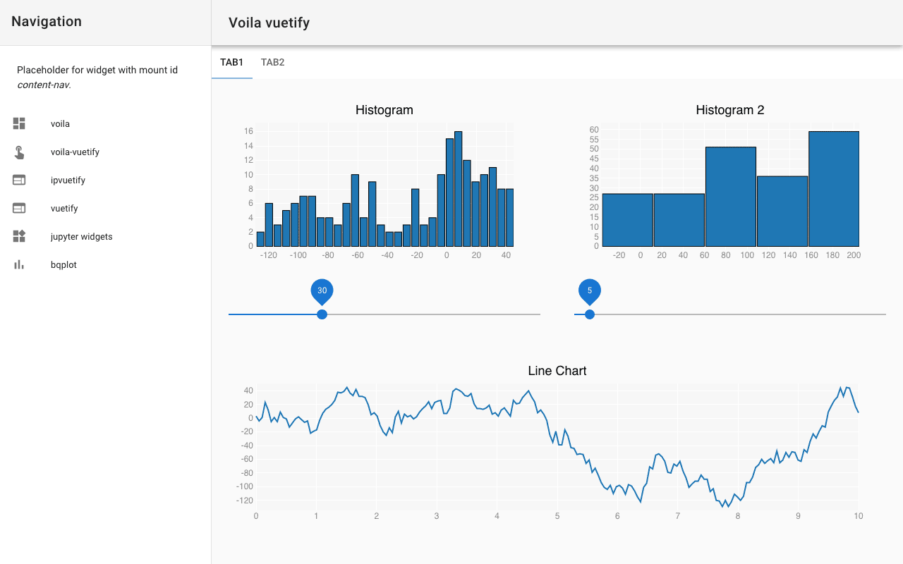
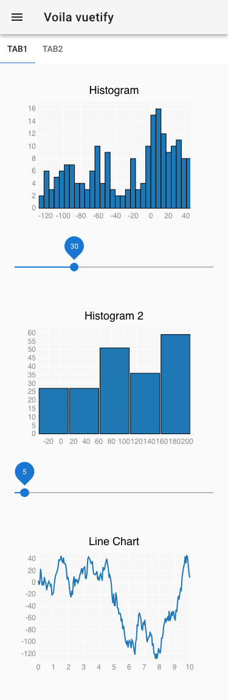

Templating
==========

.. _voila-gridstack:

Voila-Gridstack
---------------

`gridstack.js <https://gridstackjs.com/>`_ ist ein jQuery-Plugin für
Widget-Layouts. Dies ermöglicht mehrspaltige Drag & Drop-Raster und anpassbare,
für `Bootstrap v3 <https://getbootstrap.com/docs/3.4/>`_ geeignete Layouts.
Zudem funktioniert es  mit `knockout.js <https://knockoutjs.com/>`_ und
Touch-Geräten.

Das Gridstack-Voilà-Template verwendet die Metadaten der Notebook-Zellen, um das
Layout des Notebooks zu gestalten. Es soll die gesamte Spezifikation für die
veralteten `Jupyter Dashboards Layout Extension
<https://jupyter-dashboards-layout.readthedocs.io/en/latest/>`_ unterstützen.

voila-material
--------------

`voila-material <https://github.com/voila-dashboards/voila-material>`_ ist ein
Template zur Verwendung von Voilà mit dem `Material Design Component Framework
<https://m3.material.io>`_.

Installation
~~~~~~~~~~~~

.. code-block:: console

   $ uv add voila-material

Verwendung
~~~~~~~~~~

``voila-material`` könnt ihr verwenden mit :samp:`voila {MY_NOTEBOOK}.ipynb
--template=material` oder für das Dark-Theme mit :samp:`voila
{MY_NOTEBOOK}.ipynb --template=material --theme=dark`.

voila-vuetify
-------------

`voila-vuetify <https://github.com/voila-dashboards/voila-vuetify>`_ ist ein
Template zur Verwendung von Voilà mit `Vuetify.js <https://vuetifyjs.com/>`_.

Installation
~~~~~~~~~~~~

.. code-block:: console

   $ uv add voila-vuetify

Verwendung
~~~~~~~~~~

Um ``voila-vuetify`` in einem Notebook zu verwenden, müsst ihr zunächst
``ipyvuetify`` importieren:

.. code-block:: python

   import ipyvuetify as v

Anschließend könnt ihr ein Layout erstellen :abbr:`z.B. (zum Beispiel)` mit:

.. code-block:: python

    v.Tabs(
        _metadata={"mount_id": "content-main"},
        children=[
            v.Tab(children=["Tab1"]),
            v.Tab(children=["Tab2"]),
            v.TabItem(
                children=[
                    v.Layout(
                        row=True,
                        wrap=True,
                        align_center=True,
                        children=[
                            v.Flex(
                                xs12=True,
                                lg6=True,
                                xl4=True,
                                children=[fig, slider],
                            ),
                            v.Flex(
                                xs12=True,
                                lg6=True,
                                xl4=True,
                                children=[figHist2, sliderHist2],
                            ),
                            v.Flex(xs12=True, xl4=True, children=[fig2]),
                        ],
                    )
                ]
            ),
            v.TabItem(children=[v.Container(children=["Lorum ipsum"])]),
        ],
    )

:doc:`bqplot_vuetify_example`. könnt ihr nutzen mit:

.. code-block:: console

   $ uv run voila --template vuetify-default 'bqplot_vuetify_example.ipynb'

Anschließend öffnet sich euer Standardbrowser mit der URL
``http://localhost:8866/`` und zeigt euch die Plots im Responsive Material
Design.

Beispiel für Voilà-vuetify mit der Monitorauflösung eines Laptop MDPI-Screen:

Beispiel für Voilà-vuetify mit der Monitorauflösung eine iPhone X:

voila-reveal
------------

`voila-reveal <https://github.com/voila-dashboards/voila-reveal>`_ ist ein
Template für Slideshows basierend auf `RevealJS <https://revealjs.com/>`_. Es
wird bereits mit voilà installiert.

Verwendung
~~~~~~~~~~

Ihr könnt das Template nutzen mit:

.. code-block:: console

   $ uv run voila --template=reveal 'reveal.ipynb'

Durch zusätzliche Optionen können die Standardeinstellungen überschrieben
werden, :abbr:`z.B. (zum Beispiel)` um den Standardwert für den Übergang
``Fade`` mit ``Zoom`` zu überschrieben mit:

.. code-block:: console

   $ uv run voila --template=reveal --VoilaConfiguration.resources="{'reveal': {'transition': 'zoom'}}" 'reveal.ipynb'

Sollen Konfigurationsoptionen dauerhaft gespeichert werden, so kann eine Datei
``conf.json`` in ``./.venv/share/jupyter/nbconvert/templates/reveal/`` angelegt
werden:

.. code-block:: javascript

    {
      "traitlet_configuration": {
        "resources": {
          "reveal": {
            "scroll": false,
            "theme": "simple",
            "transition": "zoom"
          }
        }
      }
    }

Ihr könnt euer Notebook dann in eine Slideshow verwandeln in
:menuselection:`View --> Cell Toolbar --> Slideshow`. In der Werkzeugleiste
einer könnt ihr auswählen zwischen

Slide
    von links nach rechts
Sub-Slide
    von oben nach unten
Fragment
    Stop innerhalb einer Folie
Notes
    Anmerkungen für Sprecher*innen, die beim Drücken der ``t``-Taste in einem
    neuen Fenster geöffnet werden

Wenn Ihr eure Vortragsfolien auf `binder <https://mybinder.org/>`_
veröffentlichen wollt, müsst Ihr den folgenden Tag in die Metadaten eures
Notebooks schreiben in :menuselection:`Edit --> Edit Notebook Metadata`:

.. code-block:: javascript

   "rise": {
       "autolaunch": true
   }

Ihr könnt ebenfalls das `chalkboard reveal-Plugin
<https://github.com/rajgoel/reveal.js-plugins/tree/master/chalkboard>`_
verwenden wenn Ihr die Metadaten des Notebooks erweitert um:

.. code-block:: javascript

   "rise": {
     "enable_chalkboard": true
   }

Eigene Templates erstellen
--------------------------

Ein Voilà-Template ist ein Ordner, der sich im Virtual-Environment unter
``.venv/share/jupyter/voila/templates`` befindet und :abbr:`z.B. (zum Beispiel)`
Folgendes enthält:

.. code-block:: console

   .venv/share/jupyter/voila/templates/mytheme
   ├── conf.json
   ├── nbconvert_templates
   │   └── voila.tpl
   ├── static
   │   ├── mytheme.js
   │   └── mytheme.css
   └── templates
       ├── 404.html
       ├── browser-open.html
       ├── error.html
       ├── page.html
       └── tree.html

``conf.json``
    Konfigurationsdatei, die :abbr:`z.B. (zum Beispiel)` auf das Basis-Template
    verweist:

    .. code-block:: json

       {"base_template": "default"}

``nbconvert_templates``
    Benutzerdefinierte Templates für :doc:`/nbconvert`.
``static``
    Verzeichnis für statische Dateien.
``templates``
    Benutzerdefinierte Tornado-Templates.

Cookiecutter-Template für Voilà
~~~~~~~~~~~~~~~~~~~~~~~~~~~~~~~

`voila-template-cookiecutter <https://github.com/voila-dashboards/voila-template-cookiecutter>`_ ist eine Vorlage für :doc:`Cookiecutter
<python-basics:packs/templating/features>`, das euch den Start erleichtern kann.

Anpassen von Voila mit Hooks
----------------------------

Voilà bietet Hooks, die euch ermöglichen, das Verhalten an eure speziellen
Bedürfnisse anzupassen. Diese Hooks ermöglichen, benutzerdefinierte Funktionen
an bestimmten Punkten während der Ausführung von Voilà einzubinden, wodurch ihr
die Kontrolle über die Ausführung von Notebooks und die Konfiguration des
Frontends erhaltet.

Derzeit unterstützt Voilà die folgenden Hooks:

``prelaunch_hook``
    Zugriff und Änderung der Tornado-Anfrage und des Notizbuchs vor der
    Ausführung, um nach Authentifizierungs-Cookies zu suchen, auf Details der
    Request-Header zuzugreifen oder das Notebook vor dem Rendering zu ändern
    :abbr:`z.B. (zum Beispiel)`:

    .. code-block:: python

       def prelaunch_hook(req: tornado.web.RequestHandler,
                notebook: nbformat.NotebookNode,
                cwd: str) -> Optional[nbformat.NotebookNode]:

    ``req``
        verweist auf den Tornado RequestHandler, mit dem ihr Parameter,
        Kopfzeilen :abbr:`usw. (und so weiter)` prüfen könnt.
    ``notebook``
        verweist auf ``NotebookNode``, den ihr verändern könnt, um :abbr:`z.B.
        (zum Beispiel)` Zellen zu injizieren oder andere Änderungen auf
        Notebookebene vorzunehmen.
    ``cwd``
        ist das aktuelle Arbeitsverzeichnis, falls ihr etwas auf der Festplatte
        ändern wollt.

    Der Rückgabewert eurer Hook-Funktion kann entweder ``None`` oder ein
    ``NotebookNode`` sein.

``page_config_hook``
    passt das ``page_config``-Objekt an, das die Konfiguration des
    Voilà-Frontends steuert. Frontend-Einstellungen wie die URLs für statische
    Assets oder andere Konfigurationsparameter können so geändert werden.

    Der Standard-``page_config_hook`` sieht so aus:

    .. code-block:: javascript

       page_config = {
         "appVersion": __version__,
         "appUrl": "voila/",
         "themesUrl": "/voila/api/themes",
         "baseUrl": base_url,
         "terminalsAvailable": False,
         "fullStaticUrl": url_path_join(base_url, "voila/static"),
         "fullLabextensionsUrl": url_path_join(base_url, "voila/labextensions"),
         "extensionConfig": voila_configuration.extension_config,
       }

Es gibt zwei Möglichkeiten, die Hook-Funktion zu Voilà hinzuzufügen:

* eine :file:`voila.py`-Konfigurationsdatei in dem Verzeichnis, in dem ihr Voilà
  startert

  .. code-block:: python

     def prelaunch_hook_function(req, notebook, cwd):
         """Add your prelaunch hook heere"""
         return notebook

     def page_config_hook_function(current_page_config, **kwargs):
         """Modify the current_page_config"""
         return new_page_config

     c.VoilaConfiguration.prelaunch_hook = hook_function
     c.VoilaConfiguration.page_config_hook = page_config_hook

* ein Python-Skript, das Voilà startet, :abbr:`z.B. (zum Beispiel)`

  .. code-block:: python

     def parameterize_with_papermill(req, notebook, cwd):
         import tornado

         # Grab parameters
         parameters = req.get_argument("parameters", {})

         # try to convert to dict if not e.g. string/unicode
         if not isinstance(parameters, dict):
             try:
                 parameters = tornado.escape.json_decode(parameters)
             except ValueError:
                 parameters = None

         # if passed and a dict, use papermill to inject parameters
         if parameters and isinstance(parameters, dict):
             from papermill.parameterize import parameterize_notebook

             # setup for papermill
             # these two blocks are done to avoid triggering errors in
             # papermill’s notebook loading logic
             for cell in notebook.cells:
                 if 'tags' not in cell.metadata:
                     cell.metadata.tags = []
                 if "papermill" not in notebook.metadata:
                     notebook.metadata.papermill = {}

             # Parameterize with papermill
             return parameterize_notebook(notebook, parameters)

     def page_config_hook(
        current_page_config: Dict[str, Any],
        base_url: str,
        settings: Dict[str, Any],
        log: Logger,
        voila_configuration: VoilaConfiguration,
        notebook_path: str
        ):
        page_config['fullLabextensionsUrl'] = '/custom/labextensions_url'
        return page_config

Ihr könnt beide Hooks gleichzeitig verwenden, indem ihr eurer Voilà-App
folgendes hinzufügt:

.. code-block:: python

   from voila.app import Voila
   from voila.config import VoilaConfiguration

   config = VoilaConfiguration()
   config.prelaunch_hook = parameterize_with_papermill
   config.page_config_hook = page_config_hook
   app = Voila()
   app.voila_configuration = config

   app.start()
