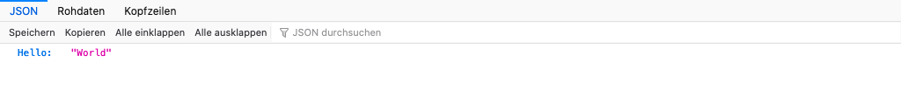
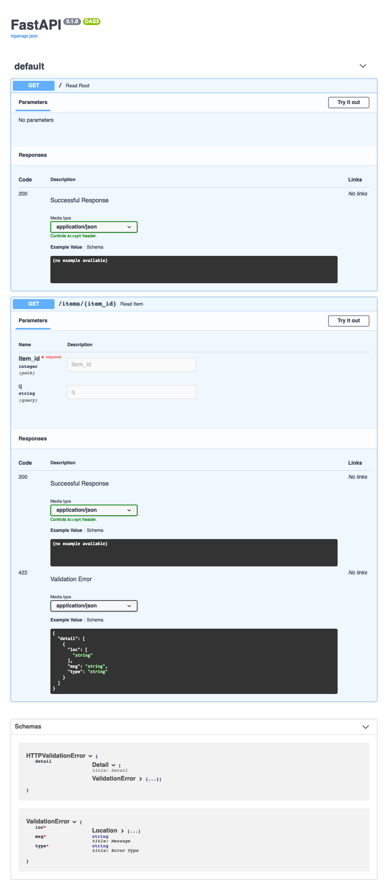
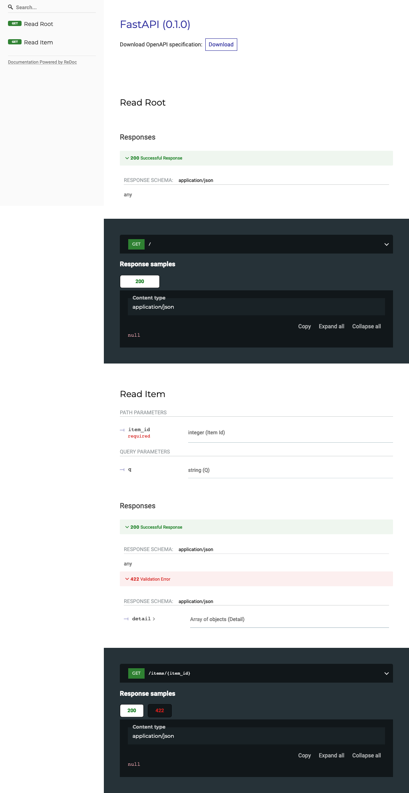

Beispiel
========

1. Erstellen
------------

Erstellt die Datei ``main.py`` mit:

.. code-block:: python

    from typing import Optional
    from fastapi import FastAPI

    app = FastAPI()

    @app.get("/")
    def read_root():
        return {"Hello": "World"}

    @app.get("/items/{item_id}")
    def read_item(item_id: int, q: Optional[str] = None):
        return {"item_id": item_id, "q": q}

2. Ausführen
------------

Startet den Server mit:

.. code-block:: console

    $ pipenv run uvicorn main:app --reload
    INFO:     Uvicorn running on http://127.0.0.1:8000 (Press CTRL+C to quit)
    INFO:     Started reloader process [89155] using statreload
    INFO:     Started server process [89164]
    INFO:     Waiting for application startup.
    INFO:     Application startup complete.

3. Überprüfen
-------------

Öffnet Euren Browser unter http://127.0.0.1:8000/ und Ihr werdet folgendes
sehen:

   :alt:FastAPI root

Ihr erhaltet auch eine interaktive API-Dokumentation, die vom `Swagger UI
<https://github.com/swagger-api/swagger-ui>`_ unter http://127.0.0.1:8000/docs
bereitgestellt wird:

   :alt:FastAPI swagger docs

Ihr erhaltet auch eine alternative automatische Dokumentation von `ReDoc
<https://github.com/Redocly/redoc>`_ unter http://127.0.0.1:8000/redoc:

   :alt:FastAPI ReDoc documentation

4. Aktualisierungen
-------------------

Jetzt ändern wir die Datei ``main.py`` um einen Text von einer ``PUT``-Anfrage
zu erhalten:

.. code-block:: python
   :emphasize-lines: 3,7-10,20-22

    from typing import Optional
    from fastapi import FastAPI
    from pydantic import BaseModel

    app = FastAPI()

    class Item(BaseModel):
        name: str
        price: float
        is_offer: Optional[bool] = None

    @app.get("/")
    def read_root():
        return {"Hello": "World"}

    @app.get("/items/{item_id}")
    def read_item(item_id: int, q: Optional[str] = None):
        return {"item_id": item_id, "q": q}

    @app.put("/items/{item_id}")
    def update_item(item_id: int, item: Item):
        return {"item_name": item.name, "item_id": item_id}

Der Server sollte die Datei automatisch neu laden, da wir dem unicorn-Befehl
``--reload`` hinzugefügt haben. Auch die interaktive API-Dokumentation zeigt nun
den neuen Body mit ``PUT``. Wenn Ihr auf die Schaltfläche *Try it out* klickt
und einen Wert für den Parameter ``item_id`` angebt, wird beim Klick auf die
*Execute*-Schaltfläche der Parameter vom Browser an das API übertragen und die
Antwort auf dem Bildschirm angezeigt:

.. code-block:: javascript

    {
      "item_name": "string",
      "item_id": 1234
    }
