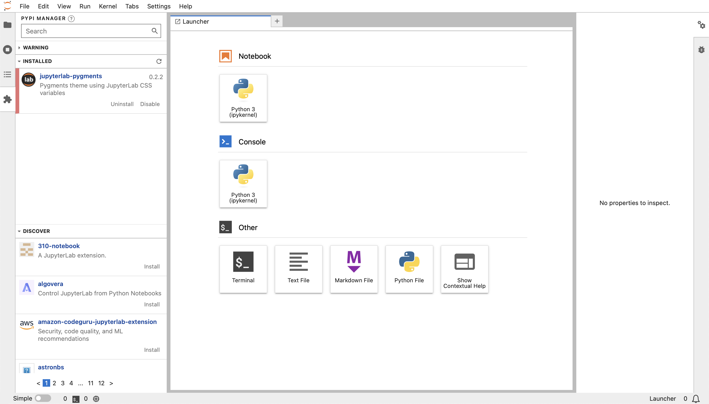

JupyterLab installieren
=======================

Erstellen einer virtuellen Umgebung mit JupyterLab
--------------------------------------------------

.. code-block:: console

   $ python3 -m venv myproject
   $ cd myproject
   $ . bin/activate
   $ python -m pip install jupyterlab

JupyterLab starten
------------------

.. code-block:: console

   $ jupyter lab
   [I 2023-06-16 13:01:43.205 ServerApp] Package jupyterlab took 0.0000s to import
   ...
       To access the server, open this file in a browser:
           file:///Users/veit/Library/Jupyter/runtime/jpserver-48904-open.html
       Or copy and paste one of these URLs:
           http://localhost:8888/lab?token=72d33027f130e602f43ef0cdfbff7471c8406ffafd94f075
           http://127.0.0.1:8888/lab?token=72d33027f130e602f43ef0cdfbff7471c8406ffafd94f075

Euer Standard-Webbrowser wird dann mit dieser URL geöffnet.

Lokalisierung
-------------

Seit Version 3.0 bietet JupyterLab die Möglichkeit, die Anzeigesprache der
Oberfläche einzustellen. Hierfür müssen die entsprechenden Sprachpakete installiert werden, :abbr:`z.B. (zum Beispiel)`:

.. code-block:: console

   $ python -m pip install jupyterlab-language-pack-de-DE

Im `language-packs <https://github.com/jupyterlab/language-packs/>`_-Repository
findet ihr eine Liste der verfügbaren Sprachpakete.

Anschließend könnt ihr in :menuselection:`Settings --> Language` die neu
installierte Sprache auswählen.
