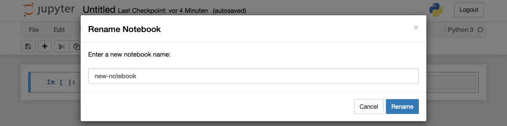

Notebook erstellen
==================

Nachdem der Notebook-Server gestartet wurde, können wir unser erstes Notebook
erstellen.

Erstellen eines Notebooks
-------------------------

In eurem Standard-Browser solltet ihr das Notebook-Dashboard mit dem Menü *New*
auf der rechten Seite sehen. In diesem Menü werden alle Notebook-Kernel
aufgeführt, initial jedoch vermutlich nur *Python 3*.

Nachdem ihr :menuselection:`New --> Python 3` ausgewählt habt, wird ein neues
Notebook ``Untitled.ipynb`` erstellt und in einem neuen Reiter angezeigt:

.. image:: initial-notebook.png

Umbenennen des Notebooks
------------------------

Als nächstes solltet ihr dieses Notebook umbenennen indem ihr auf den Titel
*Untitled* klickt:

Die Notebook-Oberfläche
-----------------------

Es gibt zwei wichtige Begriffe, um Jupyter Notebooks zu beschreiben: *Zelle* und
*Kernel*:

.. glossary::

   *Notebook-Kernel*
       *Rechenmaschine*, die den in einem Notebook enthaltenen Code ausführt.

   *Notebook-Zelle*
       Container für Text, der in einem Notebook angezeigt werden soll oder für
       Code, der vom Kernel des Notebooks ausgeführt werden soll.

       *Code*
           enthält Code, der im Kernel ausgeführt werden soll und dessen Ausgabe
           unterhalb angezeigt wird.

           Vor den Code-Zellen sind eckige Klammern, die die Reihenfolge
           anzeigen, in der der Code ausgeführt wurde.

           ``In [ ]:``
            zeigt an, dass der Code noch nicht ausgeführt wurde.
           ``In [*]:``
            zeigt an, dass die Ausführung noch nicht abgeschlossen ist.

            .. warning::
                Der Output von Zellen kann später in anderen Zellen verwendet
                werden. Daher ist das Ergebnis von der Reihenfolge abhängig.
                Wenn ihr eine andere Reihenfolge als die von oben nach unten
                wählt, erhaltet ihr später möglicherweise andere Ergebnisse,
                wenn ihr z.B. :menuselection:`Cell --> Run All` wählt.

       *Markdown*
           enthält mit `Markdown
           <https://daringfireball.net/projects/markdown/syntax>`_ formatierten
           Text, der interpretiert wird sobald :menuselection:`Run` gedrückt wird.

.. _was-ist-eine-ipynb-datei:

Was ist eine ``ipynb``-Datei?
------------------------------

Diese Datei beschreibt ein Notebook im
:doc:`python4datascience:data-processing/serialisation-formats/json/index`-Format.
Jede Zelle und ihr Inhalt einschließlich Bildern werden dort zusammen mit
einigen Metadaten aufgelistet. Ihr könnt euch diese anschauen wenn ihr im
Dashboard das Notebook auswählt und dann auf :menuselection:`edit` klickt. So
sieht :abbr:`z.B. (zum Beispiel)` die JSON-Datei für :file:`my-first-notebook.ipynb` folgendermaßen aus:

.. code-block:: json

    {
     "cells": [
      {
       "cell_type": "markdown",
       "metadata": {},
       "source": [
        "# My first notebook"
       ]
      },
      {
       "cell_type": "code",
       "execution_count": 1,
       "metadata": {},
       "outputs": [
        {
         "name": "stdout",
         "output_type": "stream",
         "text": [
          "Hello World!\n"
         ]
        }
       ],
       "source": [
        "print('Hello World!')"
       ]
      }
     ],
     "metadata": {
      "kernelspec": {
       "display_name": "Python 3",
       "language": "python",
       "name": "python3"
      },
      "language_info": {
       "codemirror_mode": {
        "name": "ipython",
        "version": 3
       },
       "file_extension": ".py",
       "mimetype": "text/x-python",
       "name": "python",
       "nbconvert_exporter": "python",
       "pygments_lexer": "ipython3",
       "version": "3.7.0"
      }
     },
     "nbformat": 4,
     "nbformat_minor": 2
    }

Speichern und Checkpoints
-------------------------

Beim Klick auf :menuselection:`Save and Checkpoint` wird eure ``ipynb``-Datei
gespeichert. Aber was hat es mit dem *Checkpoint* auf sich?

Jedesmal, wenn ihr ein neues Notebook anlegt, wird auch eine Datei angelegt,
die üblicherweise alle 120 Sekunden automatisch eure Änderungen speichert.
Dieser Checkpoint findet sich üblicherweise in einem versteckten Verzeichnis
namens :file:`.ipynb_checkpoints/`. Diese Checkpoint-Datei ermöglicht euch
daher, eure nicht gespeicherten Daten im Falle eines unerwarteten Problems
wiederherzustellen. Ihr könnt in :menuselection:`File --> Revert to Checkpoint`
zu einer der letzten Checkpoints zurückgehen.

Tipps & Tricks
--------------

#. Gebt dem Notebook einen Titel (:samp:`# {MY TITLE}`) und ein aussagekräftiges
   Vorwort, um den Inhalt und Zweck des Notebooks zu beschreiben.
#. Erstellt Überschriften und Dokumentationen in Markdown-Zellen, um euer
   Notebook zu strukturieren und eure Workflow-Schritte zu erläutern. Dabei ist
   es vollkommen egal, ob ihr das für eure Kollegen oder für euch zukünftig
   selbst macht.
#. Verwendet *Table of Contents (2)* aus der
   :doc:`../nbextensions/list`, um ein Inhaltsverzeichnis zu erstellen.
#. Verwendet die Notebook-Erweiterung :doc:`setup <../nbextensions/setup>`.
#. Verwendet *Snippets* aus der
   :doc:`/nbextensions/list`, um weitere, häufig benötigte Code-Blöcke,
   :abbr:`z.B. (zum Beispiel)` typische Importanweisungen, bequem einfügen zu
   können.
