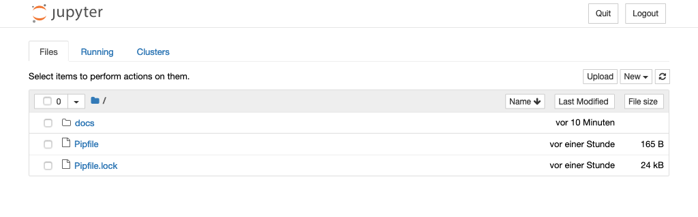

Jupyter Notebook installieren
=============================

Erstellen einer virtuellen Umgebung mit ``jupyter``
---------------------------------------------------

:term:`Virtuelle Python-Umgebungen <Virtuelle Umgebung>` ermöglichen die
Installation von Python-Paketen an einem isolierten Ort für eine bestimmte
Anwendung, anstatt sie global zu installieren. So habt ihr eure eigenen
Installationsverzeichnisse und teilt keine Bibliotheken mit anderen virtuellen
Umgebungen:

.. code-block:: console

   $ python3 -m venv myproject
   $ cd myproject
   $ . bin/activate
   $ python -m pip install jupyter

Jupyter-Notebook starten
------------------------

.. code-block:: console

   $ jupyter notebook
   ...
   [I 12:46:53.852 NotebookApp] The Jupyter Notebook is running at:
   [I 12:46:53.852 NotebookApp] http://localhost:8888/?token=53abd45a3002329de77f66886e4ca02539d664c2f5e6072e
   [I 12:46:53.852 NotebookApp] Use Control-C to stop this server and shut down all kernels (twice to skip confirmation).
   [C 12:46:53.858 NotebookApp]
       To access the notebook, open this file in a browser:
           file:///Users/veit/Library/Jupyter/runtime/nbserver-7372-open.html
       Or copy and paste one of these URLs:
           http://localhost:8888/?token=53abd45a3002329de77f66886e4ca02539d664c2f5e6072e

Euer Standard-Webbrowser wird dann mit dieser URL geöffnet.

Wenn das Notebook in eurem Browser geöffnet wird, wird das Notebook-Dashboard
mit einer Liste der Notebooks, Dateien und Unterverzeichnisse in dem Verzeichnis
angezeigt, in dem der Notebook-Server gestartet wurde. In den meisten Fällen
möchtet ihr einen Notebook-Server in eurem Projektverzeichnis starten.

