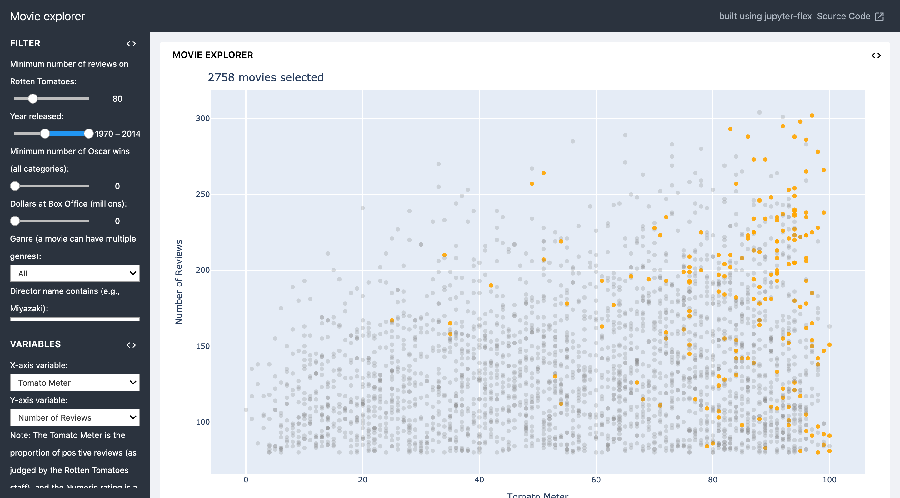
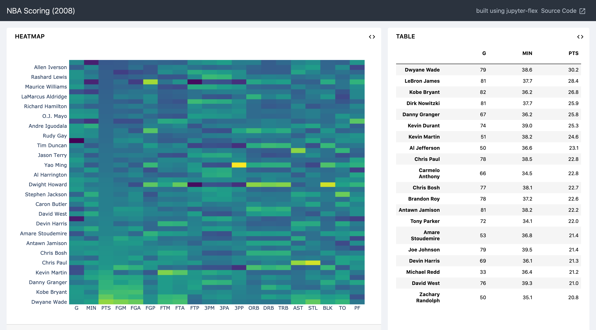
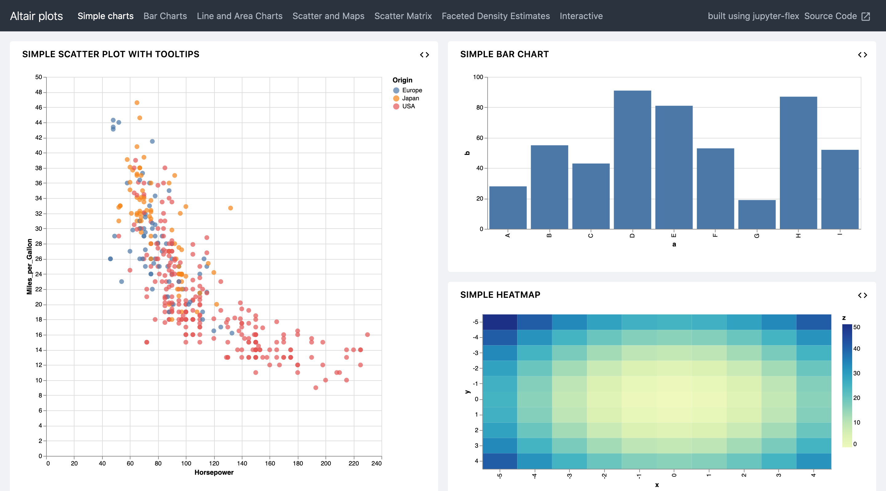

jupyter-flex
============

Jupyter-Erweiterung, die aus Notebooks Dashboards macht:

* verwendet Markdown-Header und Tags der Jupyter-Notebook-Zellen um das Layout
  und die Komponenten des Dashboards zu definieren
* flexible und einfache Möglichkeit, zeilen- und spaltenorientierte Layouts
  festzulegen
* verwendet :doc:`/workspace/jupyter/nbconvert` für statische Berichte
* verwendet :doc:`../voila/index` für dynamische Anwendungen mit einem
  Jupyter-:doc:`/workspace/jupyter/kernels/index`
* Unterstützung von :doc:`/workspace/jupyter/ipywidgets/index`

.. seealso::
   * `Docs <https://jupyter-flex.extrapolations.dev/>`_
   * `GitHub <https://github.com/danielfrg/jupyter-flex>`_

Beispiele
---------

Installation
------------

.. code-block:: console

    $ pipenv install jupyter-flex
