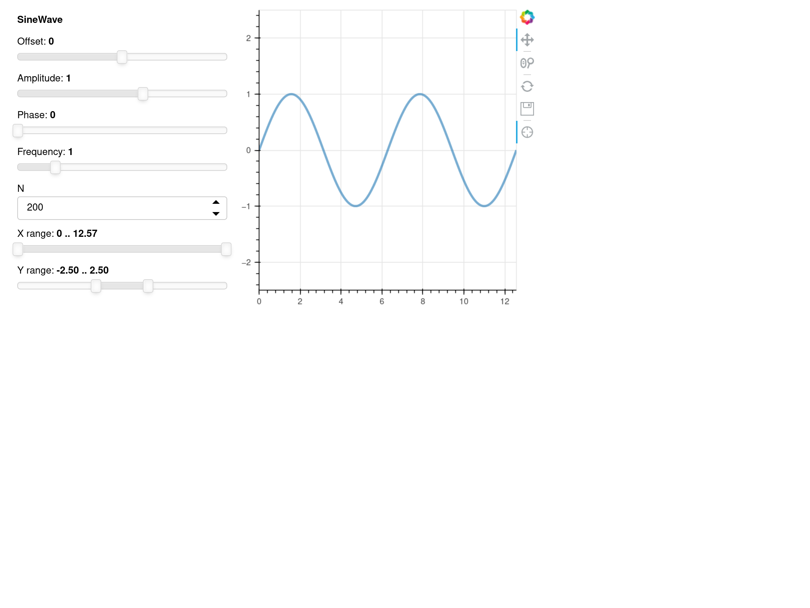

FastAPI-Integration
===================

Panel läuft üblicherweise auf einem :doc:`pyviz:bokeh/bokeh-server`, der
wiederum auf `Tornado <https://www.tornadoweb.org/en/stable/>`_ läuft. Es ist
jedoch auch oft nützlich, eine Panel-App in eine große Webanwendung einzubetten,
wie :abbr:`z.B. (zum Beispiel)` einen
:doc:`/data-processing/apis/fastapi/index`-Webserver. Die Integration in FastAPI
ist einfacher im Vergleich zu anderen wie :abbr:`z.B. (zum Beispiel)`
:doc:`Flask <pyviz:bokeh/embedding-export/flask>`, da es ein leichtgewichtigeres
Framework ist. Die Verwendung von Panel mit FastAPI erfordert nur ein wenig mehr
Aufwandals bei Notebooks und Bokeh-Servern.

Konfiguration
-------------

Bevor wir mit dem Hinzufügen einer Bokeh-Anwendung zu unserem FastApi-Server
beginnen, müssen wir einige der grundlegenden Konfigurationen in
:download:`fastAPI/main.py` einrichten:

#. Zunächst importieren wir alle erforderlichen Elemente:

   .. literalinclude:: fastAPI/main.py
      :caption: fastAPI/main.py
      :name: fastAPI/main.py

      :linenos:
      :lines: 1-3, 5-7

#. Als nächstes definieren wir ``app`` als Instanz von ``FastAPI`` und
   definieren den Pfad zum Vorlagenverzeichnis:

   .. literalinclude:: fastAPI/main.py
      :lineno-start: 10
      :lines: 10-11

#. Nun erstellen wir unsere erste Routine über eine asynchrone Funktion und
   verweisen sie an unseren BokehServer:

   .. literalinclude:: fastAPI/main.py
      :lineno-start: 14
      :lines: 14-19

#. Wie ihr dem Code ansehen könnt, wird ein `Jinja2
   <https://fastapi.tiangolo.com/advanced/templates/#using-jinja2templates>`_-Template
   :download:`fastAPI/templates/base.html` erwartet. Dieses kann :abbr:`z.B.
   (zum Beispiel)` folgenden Inhalt haben:

   .. literalinclude:: fastAPI/templates/base.html
      :caption: fastAPI/templates/base.html
      :name: fastAPI/templates/base.html
      :language: html
      :linenos:
      :lines: 1-

#. Kehren wir nun zurück zu unserer :download:`fastAPI/main.py`-Datei um mit
   ``pn.serve()`` unseren Bokeh-Server zu starten:

   .. literalinclude:: fastAPI/main.py
      :caption: fastAPI/main.py
      :name: fastAPI/main.py

      :lineno-start: 22
      :lines: 22-

   ``createApp``
       ruft in diesem Beispiel unsere Panel-App auf, die jedoch erst im nächsten
       Abschnitt behandelt wird.
   ``address``, ``port``
       Adresse und Port, an dem der Server auf Anfragen lauscht; in unserem Fall
       also ``http://127.0.0.1:5000``.
   ``show=False``
       sorgt dafür, dass der Bokeh-Server zwar gestartet wird, jedoch nicht
       unmittelbar im Browser angezeigt wird.
   ``allow_websocket_origin``
       listet die Hosts auf, die sich mit dem Websocket verbinden können. In
       unserem Beispiel soll das ``fastApi`` sein, also verwenden wir
       ``127.0.0.1:8000``.

#. Nun definieren wir die ``sliders``-App auf Basis einer Standardvorlage für
   FastAPI-Apps, die zeigt, wie Panel und FastAPI integriert werden können:

   :download:`fastAPI/sliders/sinewave.py`
       ein parametrisiertes Objekt, das euren bereits vorhandenen Code
       darstellt:

       .. literalinclude:: fastAPI/sliders/sinewave.py
          :caption: fastAPI/sliders/sinewave.py
          :name: fastAPI/sliders/sinewave.py
          :linenos:
          :lines: 1-

   :download:`fastAPI/sliders/pn_app.py`
       erstellt eine App-Funktion aus der ``SineWave``-Klasse:

       .. literalinclude:: fastAPI/sliders/pn_app.py
          :caption: fastAPI/sliders/pn_app.py
          :name: fastAPI/sliders/pn_app.py
          :linenos:
          :lines: 1-

#. Schließlich kehren wir zu unserer :download:`fastAPI/main.py` zurück und
   importieren die ``createApp``-Funktion:

   .. literalinclude:: fastAPI/main.py
      :caption: fastAPI/main.py
      :name: fastAPI/main.py
      :lineno-start: 4
      :lines: 4

Die Dateistruktur sollte nun folgendermaßen aussehen:

.. code-block:: console

    fastAPI
    ├── main.py
    ├── sliders
    │   ├── pn_app.py
    │   └── sinewave.py
    └── templates
        └── base.html

Ihr könnt den Server nun starten mit:

.. code-block:: console

    $ bin/uvicorn main:app --reload
    INFO:     Will watch for changes in these directories: ['/srv/jupyter/jupyter-tutorial/docs/web/dashboards/panel/fastAPI']
    INFO:     Uvicorn running on http://127.0.0.1:8000 (Press CTRL+C to quit)
    INFO:     Started reloader process [218214] using StatReload
    Launching server at http://127.0.0.1:5000
    INFO:     Started server process [218216]
    INFO:     Waiting for application startup.
    INFO:     Application startup complete.

Anschließend solltet ihr im Web-Browser unter der URL ``http://127.0.0.1:8000``
folgendes sehen:

