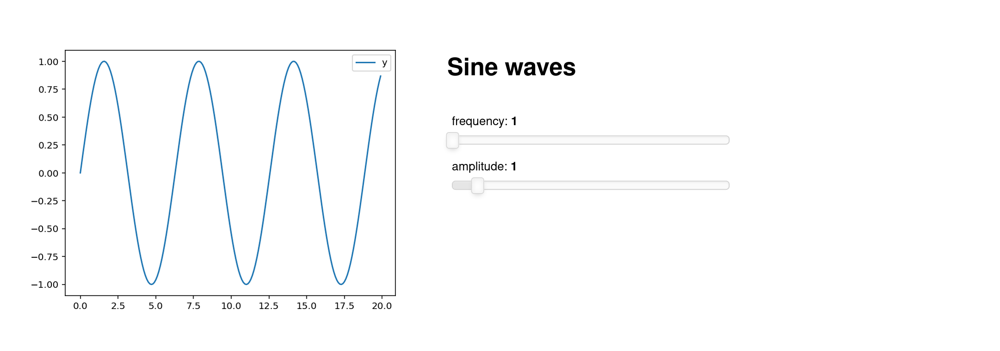

Panel im Browser ausführen mit WASM
===================================

Mit Panel könnt ihr Dashboards und andere Anwendungen in Python schreiben, auf
die über einen Webbrowser zugegriffen wird. Normalerweise läuft der
Python-Interpreter als separater Jupyter- oder Bokeh-Serverprozess und
kommuniziert mit dem JavaScript-Code, der im Client-Browser läuft. Python kann
jedoch mit :abbr:`WASM (WebAssembly)` auch direkt im Browser ausgeführt werden,
ohne dass ein separater Server erforderlich ist.

Panel nutzt hierfür `Pyodide <https://pyodide.org/en/stable/>`_ und für das
Rendering `PyScript <https://pyscript.net>`_.

Konvertieren von Panel-Anwendungen
----------------------------------

Zukünftige Versionen von Panel kann eure Panel-Anwendung aus ein oder mehreren
Python-Skripten oder Notebook-Dateien einschließlich :doc:`templates` mit
``panel convert`` in eine HTML-Datei umwandeln. Die einzige Voraussetzungen
sind:

* sie importieren nur globale Module und Pakete und keine relativen Importe von
  anderen Skripten oder Modulen
* die Bibliotheken wurden `für Pyodide kompiliert
  <https://github.com/pyodide/pyodide/tree/main/packages>`_ oder sind als :term:`Python-Wheels <Wheel>` auf dem :term:`Python Package Index (PyPI)` verfügbar.

Beispiel
--------

In folgenden Beispiel werden wir das :doc:`overview`-Notebook in eine
eigenständige HTML-Seite konvertieren mit

.. code-block:: console

    $ panel convert overview.ipynb --out pyodide
    Column
        [0] Column
            [0] FloatSlider(end=3.0, name='frequency', start=-1.0, value=1.0)
            [1] FloatSlider(end=3.0, name='amplitude', start=-1.0, value=1.0)
            [2] IntSlider(end=100, name='n', start=5, value=200)
        [1] Row
            [0] Matplotlib(Figure, name='interactive00114')
    Launching server at http://localhost:40405

Nun könnt ihr ``http://localhost:40405`` in eurem Browser öffnen und die App
auszuprobieren:

Ihr könnt nun die Datei :download:`pyodide/overview.html` in eure Github-Seiten
:abbr:`o.ä. (oder ähnliches)` einfügen – es ist kein separater Server
erforderlich.

.. seealso::
   * `Awesome Panel/Webassembly Apps
     <https://awesome-panel.github.io/examples/>`_

Optionen
--------

Im Folgenden erläutere ich einige der Optionen von ``panel convert``.

``--to``
    Das Format, in das konvertiert werden soll. Es gibt drei Optionen, die
    jeweils unterschiedliche Vor- und Nachteile haben:

    ``pyodide`` (Standard)
        Die Anwendung wird mit Pyodide im Hauptthread ausgeführt. Diese Option
        ist weniger performant als ``pyodide-worker``, erzeugt aber eine völlig
        eigenständige HTML-Datei, die nicht auf einem statischen Dateiserver,
        wie :abbr:`z.B. (zum Beispiel)` Github Pages, gehostet werden müssen.
    ``pyodide-worker``
        erzeugt HTML- und JS-Dateien, die jedoch einen Web-Worker enthälten, der
        in einem separaten Thread läuft. Dies ist die leistungsfähigste Option,
        aber die Dateien müssen auf einem statischen Dateiserver gehostet
        werden.
    ``pyscript``
        erzeugt eine HTML-Datei, die `PyScript <https://pyscript.net>`_ nutzt.
        Dies erzeugt eigenständige HTML-Dateien mit ``<py-env>``- und
        ``<py-script>``-Tags, die die Abhängigkeiten und den Anwendungscode
        enthalten. Diese Ausgabe ist am lesbarsten und sollte die gleiche
        Leistung wie die Option ``pyodide`` haben.

``-out``
    Das Verzeichnis, in das die Dateien geschrieben werden sollen.
``--pwa``
    Fügt Dateien hinzu, die die Anwendung zu einer Progressive Web-Apps machen.

    `Progressive Webanwendungen (PWAs)
    <https://de.wikipedia.org/wiki/Progressive_Web_App>`_ bieten eine
    Möglichkeit für eure Webanwendungen, sich fast wie eine native Anwendung zu
    verhalten, sowohl auf mobilen Geräten als auch auf dem Desktop. ``panel
    convert`` hat eine ``--pwa``-Option, die die notwendigen Dateien generiert,
    um eure Panel- und Pyodide-Anwendung in eine PWA zu verwandeln.

``--skip-embed``
    Überspringt das Einbetten von vorgerenderten Inhalten in der konvertierten
    Datei.

    Panel bettet vorgerenderte Inhalte in die HTML-Seite ein und ersetzt diese
    durch Live-Komponenten, sobald die Seite geladen ist. Dies kann jedoch sehr
    lange dauern. Wenn ihr dieses Verhalten deaktivieren und zunächst eine leere
    Seite rendern möchtet, verwendet die Option ``--skip-embed``.

``--index``
    erstellt einen Index wenn ihr mehrere Anwendungen auf einmal konvertiert,
    damit ihr leicht zwischen den Anwendungen navigieren könnt.
``--requirements``
    Explizite Anforderungen, die der konvertierten Datei oder einer
    ``requirements.txt``-Datei hinzugefügt werden sollen.

    Standardmäßig werden die Anforderungen aus dem Code abgeleitet.

    Wenn eine Bibliothek einen optionalen Import verwendet, der nicht aus der
    Liste der Importe eurer Anwendung abgeleitet werden kann, müsst ihr eine
    explizite Liste der Abhängigkeiten angeben.

    .. note::
       panel und seine Abhängigkeiten, einschließlich NumPy und Bokeh, werden
       automatisch geladen, :abbr:`d.h. (das heißt)` die expliziten
       Anforderungen für die obige Anwendung würden wie folgt aussehen:

       .. code-block:: console

          $ panel convert overview.ipynb --out pyodide --requirements pandas matplotlib

       Alternativ könnt ihr auch eine ``requirements.txt``-Datei bereitstellen:

       .. code-block:: console

          $ panel convert overview.ipynb --out pyodide --requirements requirements.txt

``--watch``
    Beobachten der Quelldateien.

Eine vollständige Übersicht erhaltet ihr mit ``panel convert -u``.

.. tip::

    Wenn die konvertierte Anwendung nicht wie erwartet funktioniert, könnt ihr
    die Fehler meist in der Browser-Konsole finden, :abbr:`s.a. (siehe auch)`
    `Finding Your Browser's Developer Console
    <https://balsamiq.com/support/faqs/browserconsole/>`_.

.. seealso::
    Antworten auf die am häufigsten gestellten Fragen zu Python im Browser
    findet ihr in den

    * `Pyodide FAQ <https://pyodide.org/en/stable/usage/faq.html>`_
    * `PyScript FAQ <https://docs.pyscript.net/latest/reference/faq.html>`_
